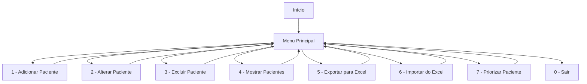

# 🗓️ Agendify

## Descrição
**Agendify** é uma agenda inteligente desenvolvida para o **Hospital Infantil Sabará**, com o objetivo de facilitar o gerenciamento de pacientes de forma prática, intuitiva e eficiente. A aplicação permite cadastrar, editar, excluir e priorizar pacientes, além de importar/exportar dados via planilhas Excel.

---

## Funcionalidades Principais

✅ Cadastro de pacientes com informações essenciais (nome, idade, data de nascimento, sexo, CPF)  
✏️ Alteração de dados já cadastrados  
❌ Exclusão de pacientes da agenda  
📋 Visualização completa da lista de pacientes  
📤 Exportação dos dados para planilhas Excel  
📥 Importação de dados a partir de planilhas Excel  
⭐ Priorização de pacientes na lista para casos urgentes  

---

## Tecnologias Utilizadas

- **Python 3**
- **pandas** (manipulação de planilhas Excel)
- Interface de linha de comando (CLI)

---

## Como Usar

1. Clone o repositório:
   ```bash
   git clone https://github.com/seu-usuario/agendify.git
   cd agendify
   ```

2. Instale as dependências:
   ```bash
   pip install pandas openpyxl
   ```

3. Execute o programa:
   ```bash
   python agendify.py
   ```

---

## Estrutura do Menu

```
1 - Adicionar paciente
2 - Alterar dado de paciente
3 - Excluir paciente
4 - Mostrar pacientes
5 - Transferir para planilha
6 - Importar planilha
7 - Priorizar paciente
0 - Sair
```

---

## Contribuição
Contribuições são bem-vindas! Sinta-se à vontade para abrir issues ou enviar pull requests.

---

## Licença
Este projeto está sob a licença MIT.


## Diagrama do Fluxo do Projeto


